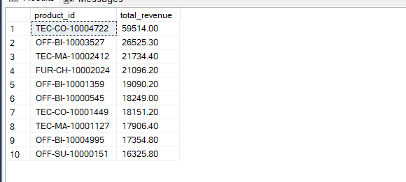
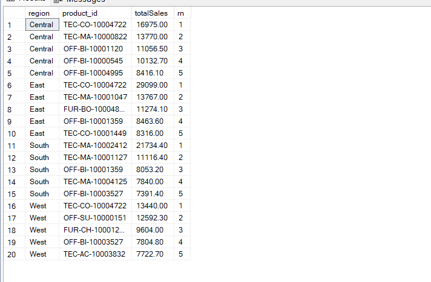
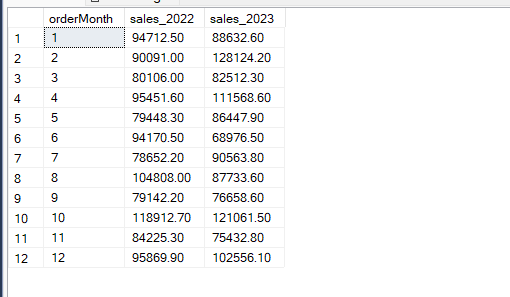
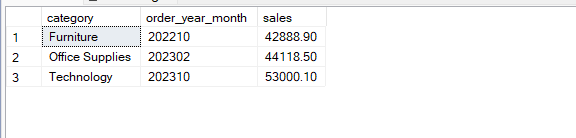
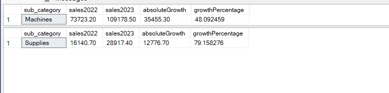

<a name="retail-orders"></a>
# Retail Orders Data Analytics

## &#129518; Introduction

Welcome to the Retail Orders Data Analytics project!
This is an ETL (Extract, Transform, Load) project showcasing data extraction from Kaggle using Python, data cleaning and transformation in Jupyter Notebook, and subsequent loading into SQL Server for further data analysis.

The project demonstrates expertise in:

    Python programming for ETL workflows.
    SQL for data analysis and querying.
    Data visualization and storytelling.

This project serves as a portfolio highlight for roles involving data engineering, data analysis, and business intelligence.

<a name="TOC"></a>
## &#128366; Table of Contents
1. [Overview](#overview)
2. [Business Problems Solved with SQL](#business-sql)
3. [Technical Workflow](#technical-workflow)
4. [SQL Queries and Outputs](#sql-queries)
5. [Conclusion](#conclusion)
6. [Resources](#resources)

---

<a name="overview"></a>
## &#127985; 1. Overview

The dataset consists of retail order data including order details, customer information, product categories, sales, and profit metrics. The primary goal of this project is to gain actionable insights into sales trends, growth patterns, and product performance.

<sup/>[↑ Back to Top](#TOC)

---

<a name="business-sql"></a>
## &#127905; 2. Business Problems Solved with SQL

Here are the key business problems analyzed using SQL queries:

    1. Top 10 Highest Revenue Generating Products
    Identify products that contribute the most revenue to guide marketing and sales strategies.

    2. Top 5 Highest Selling Products in Each Region
    Understand regional demand to optimize supply chain and inventory management.

    3. Month-over-Month Growth Comparison for 2022 vs 2023 Sales
    Measure sales growth trends year over year to identify peak seasons and growth opportunities.

    4. Highest Sales Month for Each Category
    Pinpoint sales seasonality for better forecasting and promotion planning.

    5. Sub-category with the Highest Profit Growth in 2023 Compared to 2022
    Focus on the most profitable product sub-categories for strategic investments.

<sup/>[↑ Back to Top](#TOC)

---

<a name="technical-workflow"></a>
## &#127912; 3. Technical Workflow

1. Data Extraction

    Dataset sourced from Kaggle using Kaggle API.
    Downloaded orders.csv using Python scripts in Jupyter Notebook.

2. Data Cleaning and Transformation

    Handled missing values, corrected data types, and standardized data formats.
    Processed and transformed the data into a structured format ready for analysis.

3. Data Loading

    Loaded the cleaned and transformed data into SQL Server.
    Created the table df_orders with the following schema:

```sql
CREATE TABLE df_orders(
    [order_id] INT PRIMARY KEY,
    [order_date] DATE,
    [ship_mode] VARCHAR(20),
    [segment] VARCHAR(20),
    [country] VARCHAR(20),
    [city] VARCHAR(20),
    [state] VARCHAR(20),
    [postal_code] VARCHAR(20),
    [region] VARCHAR(20),
    [category] VARCHAR(20),
    [sub_category] VARCHAR(20),
    [product_id] VARCHAR(50),
    [quantity] INT,
    [discount] DECIMAL(7,2),
    [sale_price] DECIMAL(7,2),
    [profit] DECIMAL(7,2)
);
```

4. Data Analysis

    Performed SQL queries to answer business questions and generate insights.

<sup/>[↑ Back to Top](#TOC)

---

<a name="sql-queries"></a>
## &#127906; 4. SQL Queries and Outputs

&#11093; Query 1: Top 10 Highest Revenue Generating Products

```sql
SELECT COUNT(product_id) x
, COUNT(distinct(product_id)) y
FROM df_orders;

SELECT
	TOP 10 product_id
	, SUM(sale_price) AS sales
	FROM df_orders
GROUP BY product_id 
ORDER BY 2 DESC;
```
Data preview:



<sup/>[↑ Back to Top](#TOC)

&#11093; Query 2: Top 5 Highest Selling Products in Each Region
```sql
WITH regionalSales AS (
    SELECT 
        region, 
        product_id, 
        SUM(quantity) AS total_quantity
    FROM df_orders
    GROUP BY region, product_id
)
SELECT * 
FROM (
    SELECT 
        region, 
        product_id, 
        total_quantity, 
        ROW_NUMBER() OVER (PARTITION BY region ORDER BY total_quantity DESC) AS rank
    FROM regionalSales
) rankedSales
WHERE rank <= 5;

-- OR --

WITH regionalSales AS (
    SELECT region
  , product_id, SUM(sale_price) AS totalSales
    FROM df_orders
    GROUP BY region, product_id
)
, rankedProducts AS (
    SELECT *, ROW_NUMBER() OVER (PARTITION BY region ORDER BY totalSales DESC) AS rn
    FROM regionalSales
)
SELECT *
FROM rankedProducts
WHERE rn <= 5;
```
Data preview:



<sup/>[↑ Back to Top](#TOC)

&#11093; Query 3: Month-over-Month Growth Comparison for 2022 vs 2023 Sales
```sql
WITH monthlySales AS (
    SELECT 
        YEAR(order_date) AS orderYear, 
        MONTH(order_date) AS orderMonth, 
        SUM(sale_price) AS totalSales
    FROM df_orders
    GROUP BY YEAR(order_date), MONTH(order_date)
)
SELECT 
    orderMonth, 
    SUM(CASE WHEN orderYear = 2022 THEN totalSales ELSE 0 END) AS sales_2022,
    SUM(CASE WHEN orderYear = 2023 THEN totalSales ELSE 0 END) AS sales_2023
FROM monthlySales
GROUP BY orderMonth
ORDER BY orderMonth;
```
Data preview:



<sup/>[↑ Back to Top](#TOC)

&#11093; Query 4: Highest Sales Month for Each Category
```sql
WITH categorylSales AS (
	SELECT category
	, FORMAT(order_date, 'yyyyMM') AS order_year_month
	, SUM(sale_price) AS sales
	FROM df_orders
	GROUP BY category, FORMAT(order_date, 'yyyyMM')
-- ORDER BY 2, 3
)
SELECT *
	FROM (
		SELECT *, ROW_NUMBER() OVER (PARTITION BY category ORDER BY sales DESC) AS rn
		FROM categorylSales) a
WHERE rn=1;

--[ OR ]--

WITH categorylSales AS (
	SELECT category
	, FORMAT(order_date, 'yyyyMM') AS order_year_month
	, SUM(sale_price) AS sales
	FROM df_orders
	GROUP BY category, FORMAT(order_date, 'yyyyMM')
-- ORDER BY 2, 3
)
, rankedProducts AS (
		SELECT *, ROW_NUMBER() OVER (PARTITION BY category ORDER BY sales DESC) AS rn
		FROM categorylSales
)
SELECT category, order_year_month, sales
FROM rankedProducts
WHERE rn=1;
```
Data preview:



<sup/>[↑ Back to Top](#TOC)

&#11093; Query 5: Sub-category with Highest Profit Growth (2023 vs 2022)
```sql
WITH yearlySales AS (
    SELECT 
        sub_category
        , YEAR(order_date) AS orderYear
        , SUM(sale_price) AS totalSales
    FROM df_orders
    GROUP BY sub_category, YEAR(order_date)
)
, salesComparison AS (
    SELECT 
        sub_category
        , SUM(CASE WHEN orderYear = 2022 THEN totalSales ELSE 0 END) AS sales2022
        , SUM(CASE WHEN orderYear = 2023 THEN totalSales ELSE 0 END) AS sales2023
    FROM yearlySales
    GROUP BY sub_category
)
SELECT TOP 1 
    sub_category 
    , sales2022
    , sales2023 
    , (sales2023 - sales2022) AS absoluteGrowth
    , ((sales2023 - sales2022) * 100.0 / sales2022) AS growthPercentage
FROM salesComparison
ORDER BY absoluteGrowth DESC, growthPercentage DESC;

-- [which sub category had highest growth-percentage by profit in 2023 compare to 2022] --

WITH yearlySales AS (
    SELECT 
        sub_category
        , YEAR(order_date) AS orderYear
        , SUM(sale_price) AS totalSales
    FROM df_orders
    GROUP BY sub_category, YEAR(order_date)
)
, salesComparison AS (
    SELECT 
        sub_category
        , SUM(CASE WHEN orderYear = 2022 THEN totalSales ELSE 0 END) AS sales2022
        , SUM(CASE WHEN orderYear = 2023 THEN totalSales ELSE 0 END) AS sales2023
    FROM yearlySales
    GROUP BY sub_category
)
SELECT TOP 1 
    sub_category 
    , sales2022
    , sales2023 
    , (sales2023 - sales2022) AS absoluteGrowth
    , ((sales2023 - sales2022) * 100.0 / sales2022) AS growthPercentage
FROM salesComparison
ORDER BY growthPercentage DESC, absoluteGrowth DESC;

/*** So, depending upon the precedence of the outcomes IN ['absoluteGrowth', 'growthPercentage'] in the ORDER BY clause, the output of the query varies for sure.!
Just get the preference which one.
***/
```
Data preview:



<sup/>[↑ Back to Top](#TOC)

---

<a name="conclusion"></a>
## &#128177; 5. Conclusion

This project demonstrates how structured SQL queries can uncover valuable business insights. These insights can guide strategic decision-making in areas such as marketing, inventory management, and revenue optimization.

<sup/>[↑ Back to Top](#TOC)

---

<a name="resources"></a>
## &#127887; 6. Resources

Kaggle Dataset: Retail Orders
SQL Server: Used for database management and analysis.
Python and Jupyter Notebook: Used for ETL processes.

---

<sup/>[↑ Back to Top](#retail-orders)


